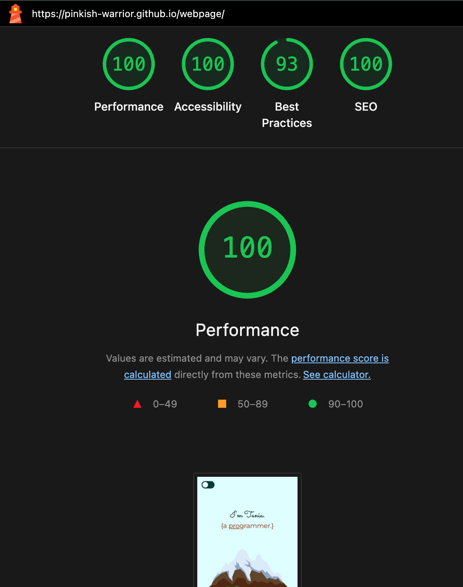
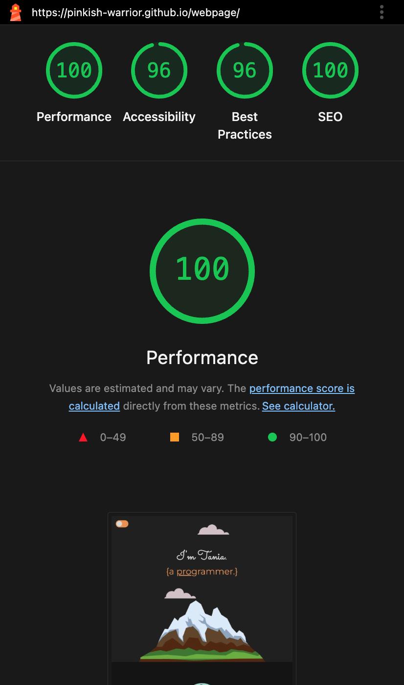

# 📜 Lessons Learned - Revamping Personal Portfolio

## Introduction

This document summarizes the key lessons learned during the process of revamping my personal portfolio website. The primary goal was to modernize the site by improving its UI/UX, performance, accessibility, and code structure, transforming it from a project created a couple of years ago into a professional, polished showcase of my skills.

---

## 🎨 1. UI/UX & Theming: Implementing Light & Dark Modes

A major goal of the revamp was to introduce a modern and user-friendly theme system.

- **CSS Variables (Custom Properties):** The foundation of the new theme system is CSS variables. By defining a palette for colors, fonts, and spacing, I could create a consistent design system. This makes the code cleaner and easier to maintain.
- **Light/Dark Mode Toggle:** I implemented a theme switcher that allows users to toggle between light and dark modes. This was achieved with:
- A simple HTML checkbox acting as the toggle.
- A JavaScript snippet that adds/removes a `.dark-mode` class to the `<html>` element.
- `localStorage` to remember the user's theme preference across sessions, preventing the "flash of incorrect theme" (FOUC).

---

## 🚀 2. Performance Optimizations

Improving the page load experience was a critical focus. The following Lighthouse reports show the final performance scores after optimization.

### Lighthouse Performance Scores

| Light Mode | Dark Mode |
| :---: | :---: |
|  |  |

Key optimizations included:

- **Preventing Cumulative Layout Shift (CLS):**
  - **Lesson:** I learned that images without defined dimensions can cause the page layout to "jump" as they load, creating a poor user experience. This is measured as CLS.
  - **Solution:** By adding `width` and `height` attributes directly to the `` tags in the HTML, the browser can reserve the correct space for each image before it loads, resulting in a stable layout. This works perfectly with responsive CSS, as the browser uses these attributes to calculate the aspect ratio while still respecting the CSS for final rendering.

- **Understanding the Back/Forward Cache (bfcache):**
  - **Lesson:** I noticed a browser console warning: `Pages with WebSocket cannot enter back/forward cache`.
  - **Solution:** I investigated and learned that this is expected behavior in a local development environment. Tools like VS Code's Live Server use a WebSocket for live reloading. This connection prevents the page from being saved in the super-fast bfcache. This is **not an issue in production**, as the deployed site does not include the live-reload script.

---

## ♿ 3. Accessibility (A11y) Enhancements

Making the website usable for everyone, including those who use screen readers, was a top priority.

- **Semantic Emojis:**
  - **Lesson:** Emojis can be confusing for screen readers if not marked up correctly.
  - **Solution:** I wrapped all decorative emojis in `` tags and gave them a `role="img"` and a descriptive `aria-label`. For example, `🏆` became `🏆`. This provides clear context for assistive technologies.

- **Valid HTML Structure:**
  - **Lesson:** Using correct HTML semantics is crucial for accessibility and browser performance.
  - **Solution:** I corrected an issue where an `<h5>` tag was improperly wrapped inside a ``. Ensuring a valid document structure makes the site more robust and easier for browsers and screen readers to parse.

---

## 🔧 4. Code & Content Refinements

During the revamp, several key refinements were made to the codebase to improve maintainability, user experience, and documentation.

- **Refined Theme-Switching Logic:** The JavaScript for the light/dark mode toggle was improved to correctly use `localStorage`. This persists the user's choice, prevents the "flash of unstyled content" (FOUC) on reload, and ensures the toggle's visual state is always accurate.

- **Improved HTML Structure and Semantics:** The entire `index.html` file was reviewed for semantic correctness. This included correcting improperly nested tags (e.g., removing a `` that was wrapping a heading) and ensuring all emojis used for presentation were wrapped in `` tags with appropriate ARIA attributes (`role='img'`, `aria-label`) for better accessibility.

- **Enhanced Project Showcase:** The "Projects" section was updated for a better user experience. Generic "View Repo" links were replaced with more descriptive and engaging links that include the project name and a relevant emoji (e.g., `🐽 Pig Game`).

- **Expanded Project Documentation:** New markdown files (`how-to-play-....md`) were created to provide clear, user-friendly instructions for the interactive game projects, adding more depth and context to the portfolio.

- **Authored a "Lessons Learned" Report:** This very document was created to formally capture the knowledge gained during the revamp process, serving as a reference for future projects and demonstrating a commitment to continuous improvement.

---

## 🌱 Reflecting on My Growth: From Junior to Mid-Level Developer

Revamping my personal webpage wasn’t just a design refresh—it marked a turning point in my journey as a developer. Revisiting my earlier work gave me a clear perspective on how far I’ve come: not only in writing cleaner code, but in the way I approach problems and design solutions.

What once felt intimidating now feels natural. I've transitioned from asking “Does this work?” to “How can this be done better?”—a subtle but powerful mindset shift that reflects a deeper level of understanding.

The growth is visible in every aspect of my work. I no longer focus only on functionality—I now think critically about performance, scalability, user experience, and long-term maintainability. I’ve embraced best practices and design principles that help me build more robust, future-proof solutions.

This evolution fills me with pride and purpose. Each bug fixed, feature improved, and system refactored has been a step forward in my journey. And while I now see myself as a mid-level developer, I know the learning never stops.

I’m excited for what comes next: collaborating with talented teams, solving real-world problems, and continuing to grow. The journey so far has been challenging and deeply rewarding—and I’m ready for the next big opportunity.

Let’s build something amazing together. 🎉
